# 附录

## WebGL 中无须交换缓冲区

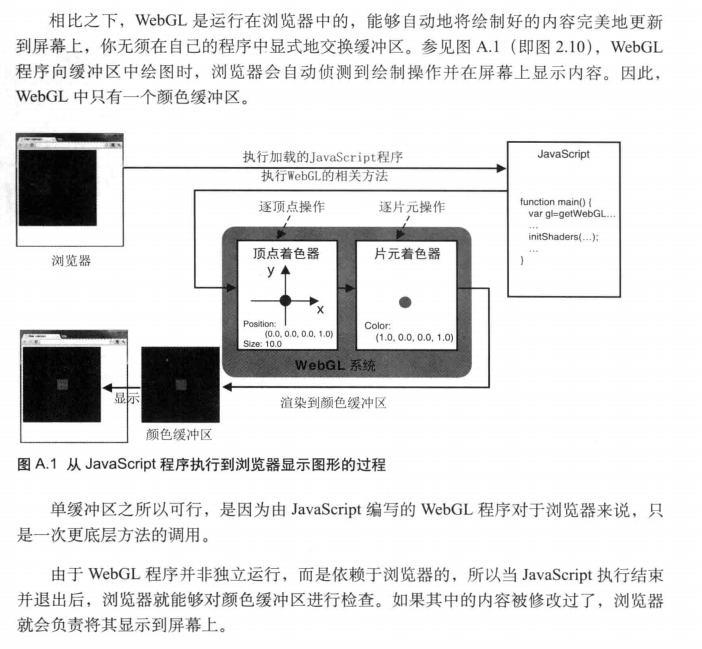

## GLSL ES 1.0 内置函数

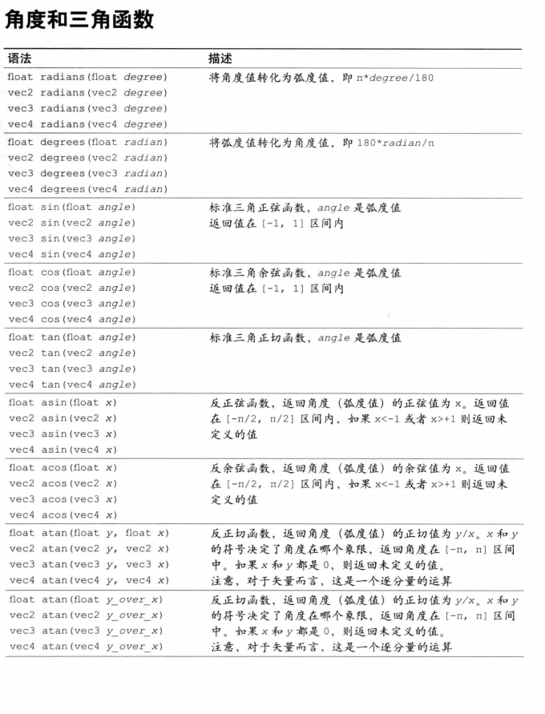
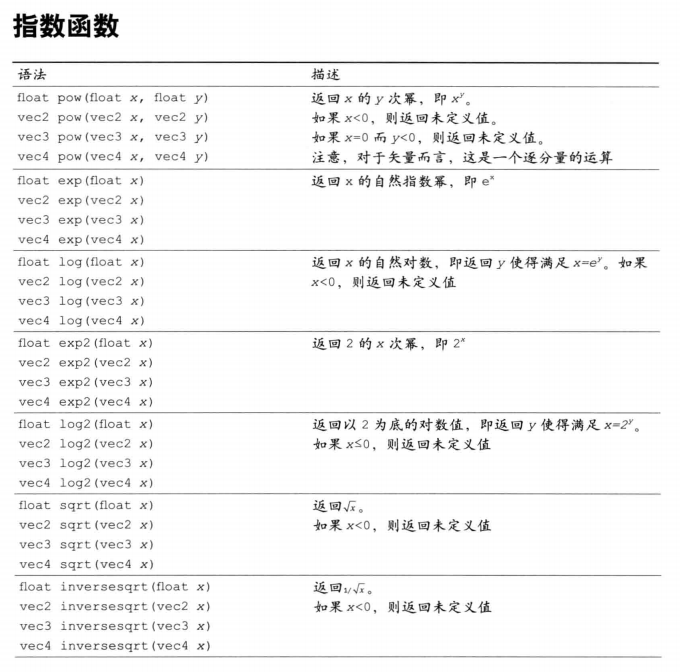
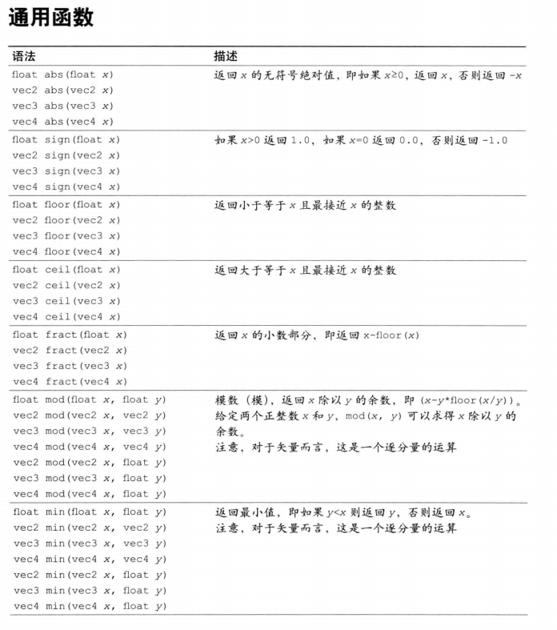
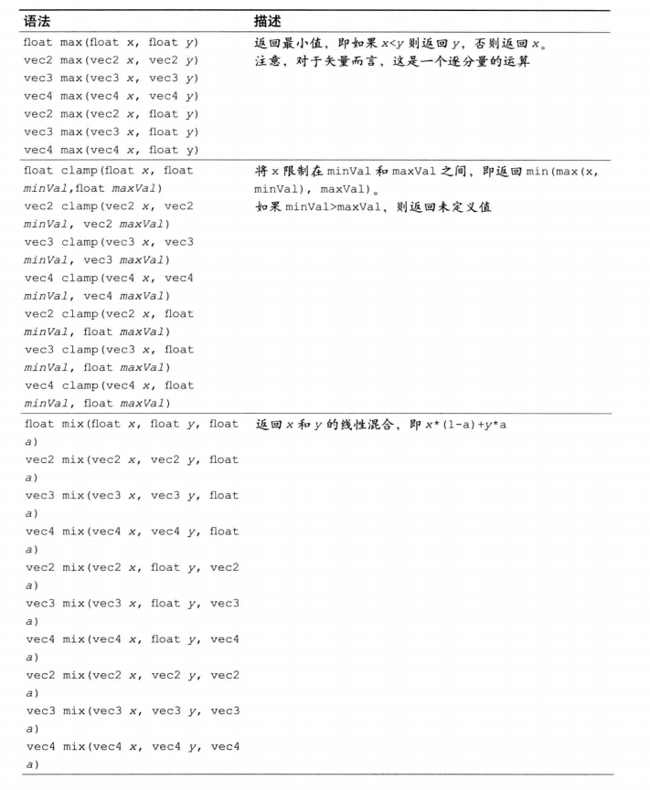
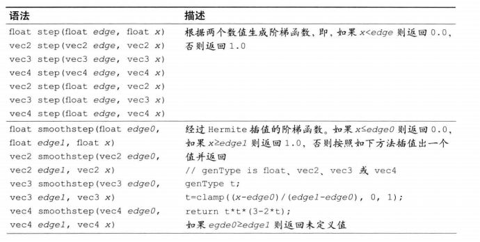
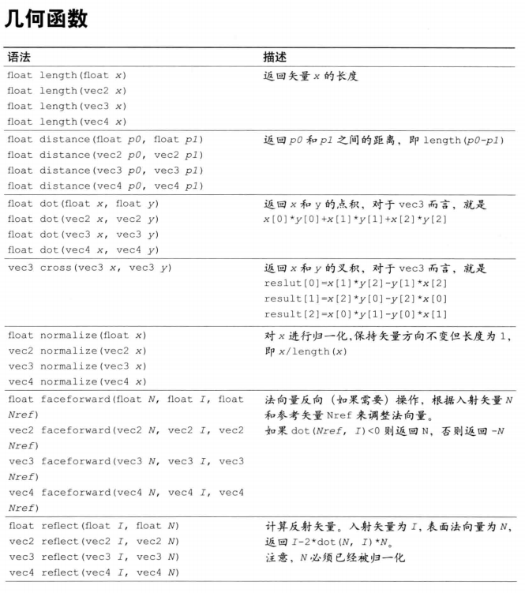
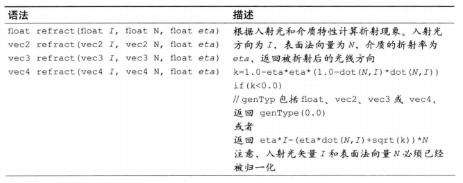
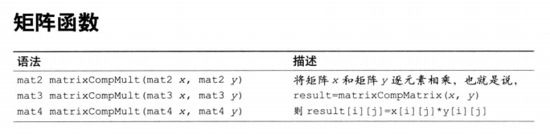
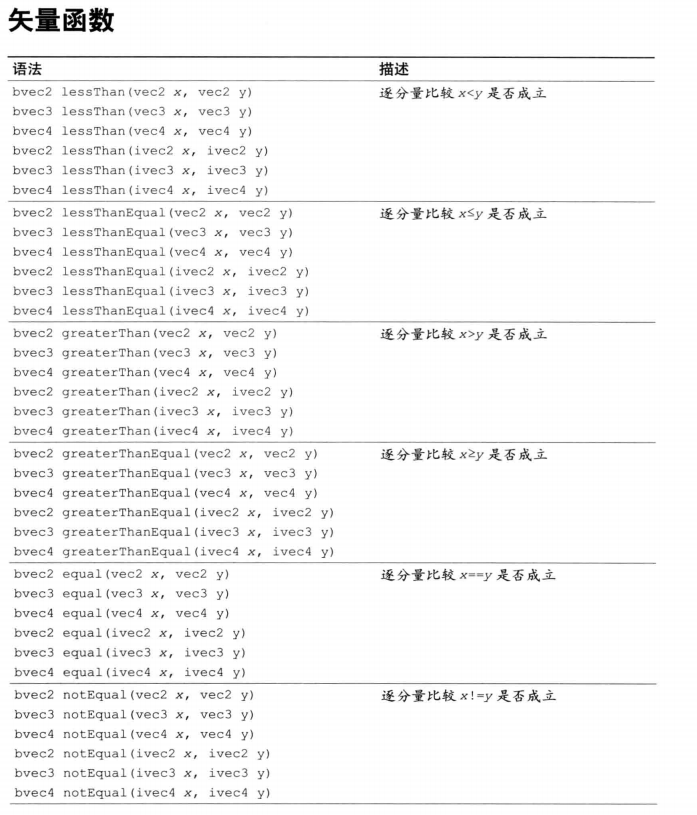
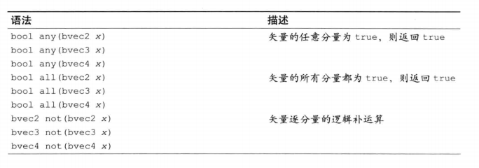
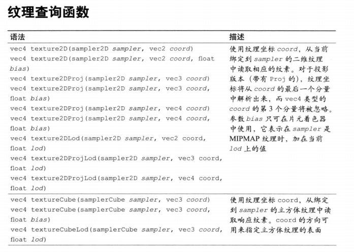

## 投影矩阵

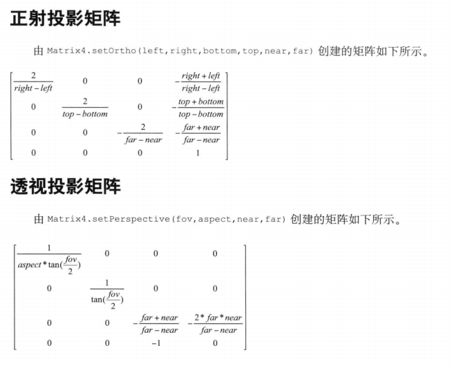

## WebGL/OpenGL:左手还是右手坐标系? <= 难点

### CoordinateSystem

如果开启隐藏面消除的话 webgl 坐标系会变成左手坐标系（裁剪坐标系）

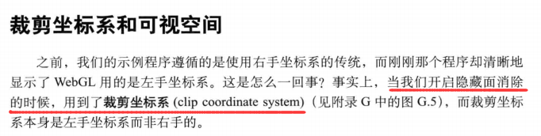

### CoordinateSystem_viewVolume

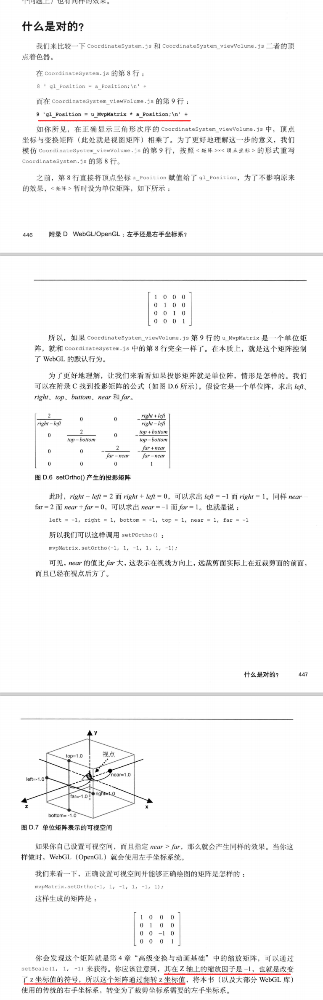

## 逆转置矩阵

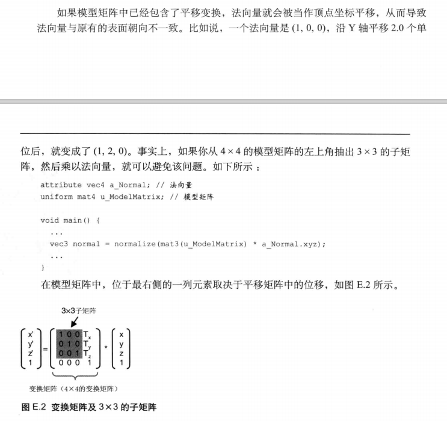
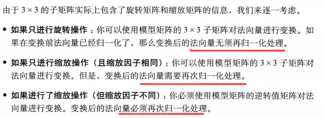
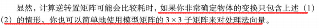

## 从文件中加载着色器

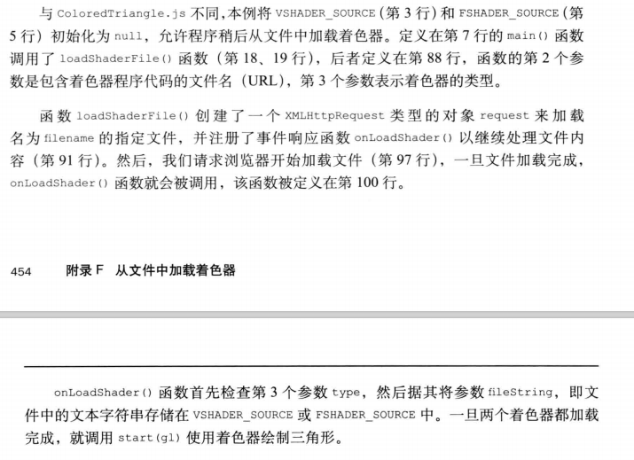

## 世界坐标系和本地坐标系

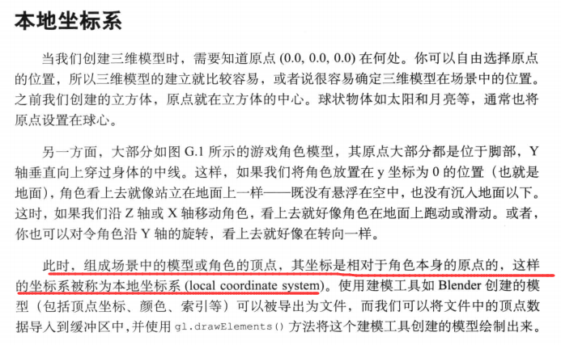
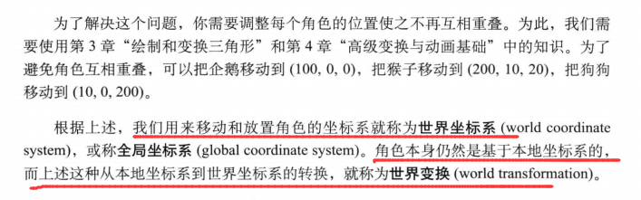
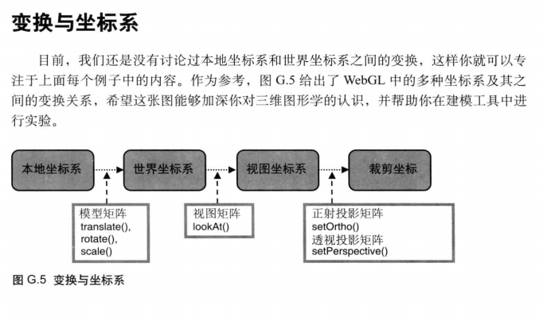

## WebGL 的浏览器设置

page 463

## 术语表

page 465
